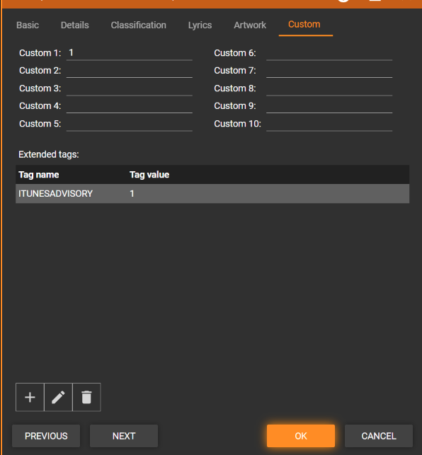

# Parental Advisory Explicit Content

Adds basic support for the ITUNESADVISORY field to indicate explicit content.

## Setting the Flag

The ITUNESADVISORY flag is not natively supported by MediaMonkey, so it appears as an [Extended Tag](https://www.mediamonkey.com/wiki/WebHelp:Editing_Track_Properties/5.0#Custom_&_Extended_Tags).

Rather than manually setting this extended tag, you can use a new context menu that is added by this addon.

From the "Edit tags" menu, select "Parental Advisory Rating" and select the appropriate value.

## Player Changes

When an explicit track is played, an "explicit" indicator appears in the track summary.

