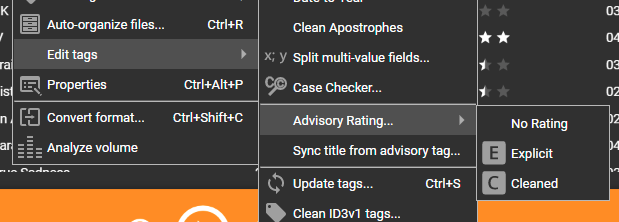
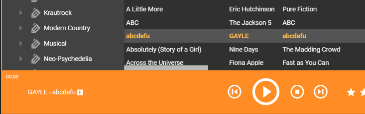

# Parental Advisory Explicit Content <!-- omit in toc -->

Adds basic support for the ITUNESADVISORY field to indicate explicit content.

- [Setting the Flag](#setting-the-flag)
- [ITUNESADVISORY Values](#itunesadvisory-values)
- [Player Changes](#player-changes)
- [Advisory Column in Track List](#advisory-column-in-track-list)
- [Save advisory in track title](#save-advisory-in-track-title)

## Setting the Flag

The ITUNESADVISORY flag is not natively supported by MediaMonkey, so it appears as an [Extended Tag](https://www.mediamonkey.com/wiki/WebHelp:Editing_Track_Properties/5.0#Custom_&_Extended_Tags) [*](docs/img/itunesadvisory_custom_tags.png).

Rather than manually setting this extended tag, you can use a new context menu that is added by this addon. From the "Edit tags" menu, select "Parental Advisory Rating" and select the appropriate value.

## ITUNESADVISORY Values

This tag has 3 supported values:

* "0": No rating or advisory
* "1": Contains explicit content
* "2": Cleaned (self-censored) to remove explicit content

## Player Changes

When an explicit track is played, an "explicit" indicator appears in the track summary.

## Advisory Column in Track List

A new column definition is also available to add to the track list views.

## Save advisory in track title

When configured to save advisory in track title, the "Explicit" or "Clean" indicator will be appended to the end of the track's title.

Note that this will typically affect the filename as well.

The main reason for doing this is to make the advisory visible on external devices or mobile apps.

